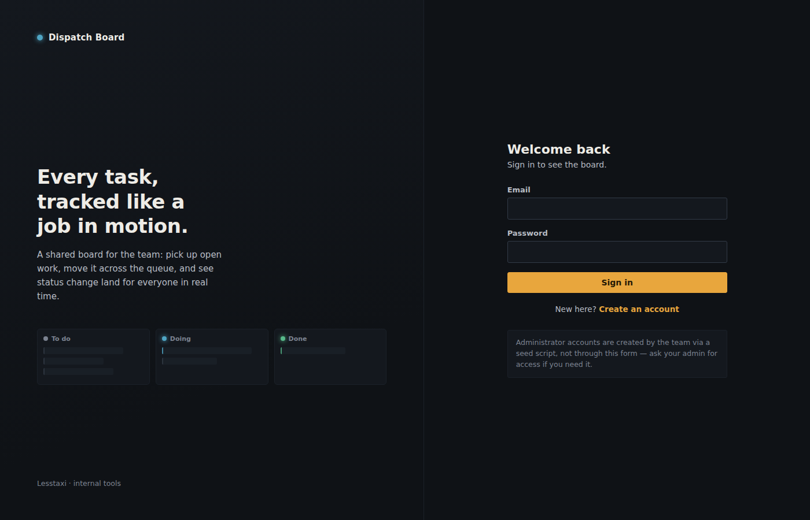
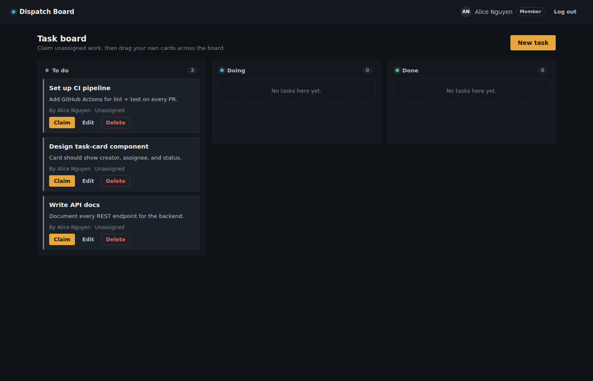
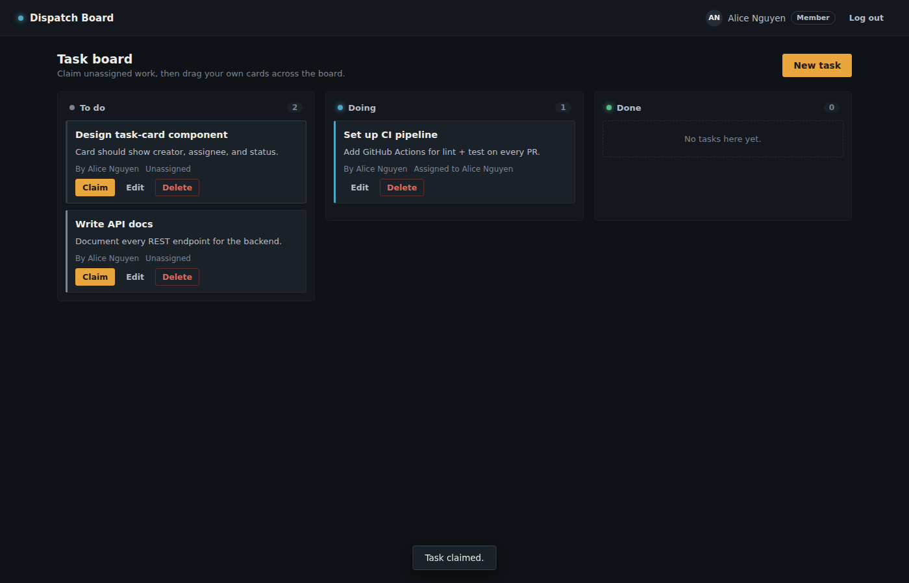
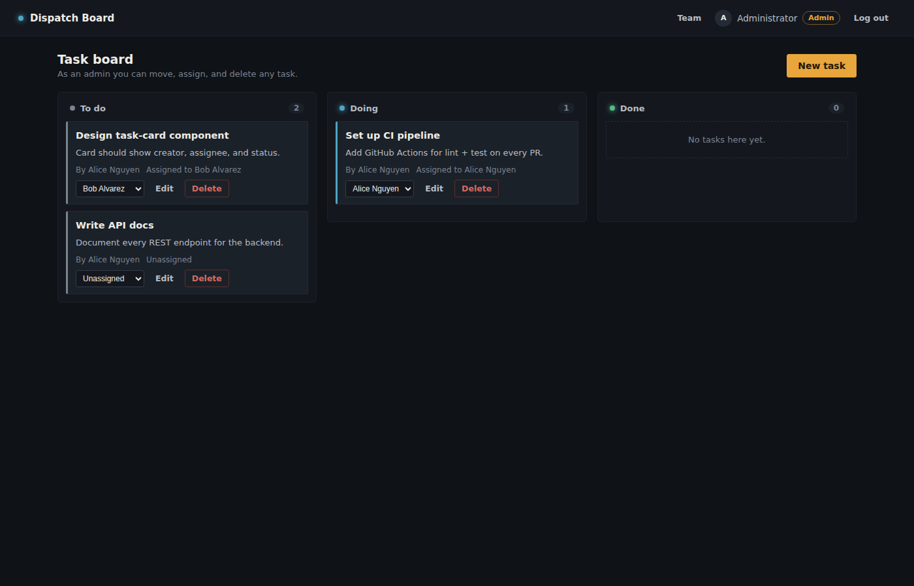
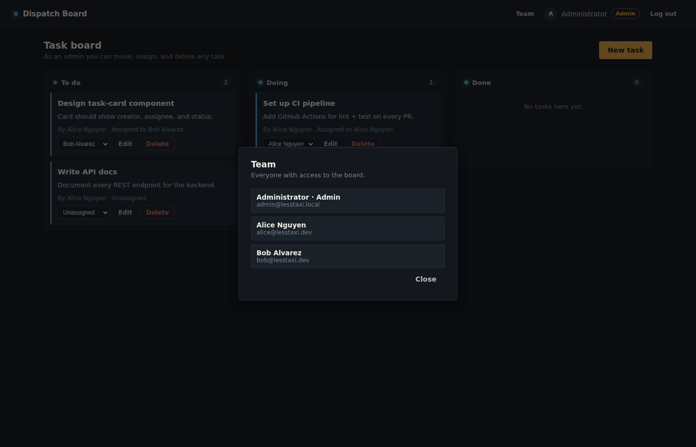

# Dispatch Board

A full-stack, Trello-like task board built for the Lesstaxi Software
Engineer Intern technical assignment: three status columns (**To Do**,
**Doing**, **Done**), drag-and-drop status changes, two user roles, and
a REST API backing it all.



## Project overview

- **`backend/`** — a REST API for auth, users, and tasks.
- **`frontend/`** — the board UI: sign in/register, drag-and-drop
  columns, task creation/editing, claiming, and (for admins)
  reassignment and a team roster.

The two are independent projects that talk over HTTP, as the
assignment requires, and can be deployed to two different hosts.

### Why the backend has zero npm dependencies

The backend is written entirely on Node's **built-in** modules —
`node:http` for routing, `node:sqlite` for the database, and
`node:crypto` for password hashing (`scrypt`) and JWT signing/verifying
(HMAC-SHA256). There's no Express, no `jsonwebtoken`, no `bcrypt`, no
`sqlite3` package. This was a deliberate choice, not a workaround: it
keeps the dependency surface at zero, makes the security-sensitive
code (auth, hashing, token verification) fully auditable in ~150 lines
instead of hidden in a library, and means `npm install` has nothing to
do — `node server.js` just works. `node:sqlite` is stable enough for
this to be a reasonable production choice on Node 22.5+; see
**Requirements** below.

The frontend is plain HTML/CSS/JavaScript — no framework, no bundler,
no build step. It's genuinely just static files, which keeps the
"frontend and backend as separate projects" requirement unambiguous
and makes deployment (Netlify/Vercel/GitHub Pages/any static host)
trivial.

## Technology stack

| Layer | Technology |
|---|---|
| Backend runtime | Node.js (`node:http`, `node:sqlite`, `node:crypto` — no external packages) |
| Database | SQLite (file-based, via `node:sqlite`) |
| Auth | Hand-rolled HS256 JWT + `scrypt` password hashing |
| Frontend | HTML5, CSS3, vanilla JavaScript (native Drag and Drop API) |
| Deployment target | Any Node host (backend) + any static host (frontend) |

## Core features implemented

- **Roles**: `user` and `admin`. Admins can only be created by
  `backend/scripts/seedAdmin.js` — there is no way to register as an
  admin through the API.
- **Task management**: title, description, status, creator, assignee,
  `createdAt`/`updatedAt` timestamps.
- **Permissions**, enforced on the backend (not just hidden in the UI):
  - Normal users can create tasks, claim any *unassigned* task for
    themselves, and edit/move tasks they created or are assigned to.
  - Admins can view all users/tasks and assign, reassign, move, or
    delete *any* task.
- **Drag-and-drop board**: moving a card between columns calls
  `PATCH /api/tasks/:id/status` immediately, so the new status
  survives a refresh.
- **Security**: passwords hashed with `scrypt` + a random per-user
  salt; JWTs signed with a server-side secret; role checks happen in
  backend middleware; secrets live in environment variables, not code.

## Screenshots

| | |
|---|---|
|  Member view — three tasks, none claimed yet |  After claiming and dragging a card into **Doing** |
|  Admin view — every task shows a reassignment dropdown |  Admin-only team roster panel |

## Repository layout

```
lesstaxi-task-board/
├── backend/
│   ├── server.js              # HTTP server entrypoint
│   ├── src/
│   │   ├── db.js               # SQLite schema + connection
│   │   ├── auth.js             # password hashing + JWT sign/verify
│   │   ├── middleware.js       # CORS, body parsing, auth/role guards
│   │   ├── routes/             # auth, task, user route handlers
│   │   └── utils/               # router, http helpers, .env loader
│   ├── scripts/seedAdmin.js    # the ONLY way to create an admin
│   ├── .env.example
│   └── package.json
└── frontend/
    ├── index.html               # sign in
    ├── register.html            # create account
    ├── board.html                # the task board
    ├── css/
    ├── js/
    └── assets/screenshots/
```

## Requirements

- **Node.js 22.5 or later** (for `node:sqlite`). Check with `node -v`.
  If you're on an older Node 22.x build where SQLite still needs a
  flag, run the backend with
  `node --experimental-sqlite server.js` instead of `node server.js`.
- No database server to install — SQLite is a single file, created
  automatically on first run.

## Local setup

### 1. Backend

```bash
cd backend
cp .env.example .env
# Edit .env:
#  - set JWT_SECRET to a long random string
#  - set ADMIN_EMAIL / ADMIN_PASSWORD to whatever you want the
#    administrator login to be
#  - leave DB_PATH and PORT as-is for local dev

npm run seed     # creates the administrator account from .env
npm start        # starts the API on http://localhost:5175
```

Verify it's up: `curl http://localhost:5175/api/health` should return
`{"status":"ok", ...}`.

### 2. Frontend

The frontend is static files — no `npm install` needed. Serve the
`frontend/` folder with anything:

```bash
cd frontend
python3 -m http.server 5500
# or: npx serve .
```

Open `http://localhost:5500/index.html`. If your backend isn't on
`http://localhost:5175`, edit `frontend/js/config.js` and change
`window.API_BASE_URL`.

**Important (local CORS):** the backend only allows the origin(s)
listed in `CORS_ORIGIN` in `.env`. Make sure that matches whatever
port you're serving the frontend from (e.g. `http://localhost:5500`),
or requests will be blocked by the browser.

### 3. Try it out

1. Open the frontend, click **Create an account**, and register a
   normal user.
2. Create a task with **New task**. It starts in **To do**, unassigned.
3. Click **Claim** to assign it to yourself, then drag it into
   **Doing** or **Done** — refresh the page to confirm it persisted.
4. Open a second browser (or an incognito window), log in as the
   admin account you seeded, and you'll see a **Team** button and a
   reassignment dropdown on every card.

## Environment variables

All configuration lives in `backend/.env` (see `.env.example` for the
full list with comments):

| Variable | Purpose |
|---|---|
| `PORT` | Port the API listens on |
| `JWT_SECRET` | Secret used to sign/verify auth tokens — must be long and random in production |
| `JWT_EXPIRES_IN_SECONDS` | How long a login session lasts |
| `CORS_ORIGIN` | Comma-separated list of origins allowed to call the API (your deployed frontend URL) |
| `DB_PATH` | Where the SQLite file lives |
| `ADMIN_NAME`, `ADMIN_EMAIL`, `ADMIN_PASSWORD` | Used only by `npm run seed` to create/update the administrator account |

The frontend has one config value, in `frontend/js/config.js`:
`window.API_BASE_URL`, pointing at the deployed backend.

## Deployment

### Backend (any Node host — Render, Railway, Fly.io, a VPS, etc.)

1. Push the `backend/` folder to your host of choice as a Node web
   service.
2. Set the start command to `npm start` (equivalent to `node server.js`).
3. Confirm the host's Node version is **22.5+** so `node:sqlite`
   works without a flag; if it's an older Node 22 build, change the
   start command to `node --experimental-sqlite server.js`.
4. Set the environment variables from the table above in the host's
   dashboard (`JWT_SECRET`, `CORS_ORIGIN` = your deployed frontend
   URL, `ADMIN_EMAIL`, `ADMIN_PASSWORD`, etc.). Do **not** commit `.env`.
5. **Persistent disk:** SQLite writes to a file (`DB_PATH`). On hosts
   with ephemeral filesystems (e.g. most free tiers), attach a small
   persistent volume/disk and point `DB_PATH` at a path on it, or the
   database will reset on every redeploy.
6. After the first deploy, run the seed script once — either via the
   host's one-off/shell command feature (`npm run seed`) or by SSHing
   in — to create the administrator account.

### Frontend (any static host — Netlify, Vercel, GitHub Pages, etc.)

1. Edit `frontend/js/config.js` and set `window.API_BASE_URL` to your
   deployed backend's URL (e.g. `https://taskboard-api.onrender.com`).
2. Deploy the `frontend/` folder as-is — it's static files, no build
   step.
3. Once you know the deployed frontend URL, go back to the backend's
   `CORS_ORIGIN` env var and set it to that URL, then redeploy the
   backend (or restart it) so the browser is allowed to call the API.

## API reference

All endpoints are prefixed with `/api`. Authenticated endpoints expect
`Authorization: Bearer <token>`.

| Method | Path | Auth | Description |
|---|---|---|---|
| POST | `/auth/register` | — | Create a normal-user account |
| POST | `/auth/login` | — | Log in, returns `{ token, user }` |
| GET | `/auth/me` | user | Current user's profile |
| GET | `/tasks` | user | List every task on the board |
| POST | `/tasks` | user | Create a task (starts unassigned, in `todo`) |
| PATCH | `/tasks/:id` | owner/admin | Edit title/description |
| PATCH | `/tasks/:id/status` | assignee/admin | Move between `todo`/`doing`/`done` |
| PATCH | `/tasks/:id/assign` | user (self-claim) / admin (any) | Claim or reassign a task |
| DELETE | `/tasks/:id` | creator/admin | Delete a task |
| GET | `/users` | admin | List all users |
| GET | `/health` | — | Liveness check |

## Design notes / assumptions

- The board is **shared**: every logged-in user sees every task, and
  columns are just tasks grouped by `status`. This matches "a task
  board" (singular) rather than per-user private boards, and is what
  makes claiming/dragging meaningful across users.
- "Manage their own tasks" is interpreted as: a normal user can edit a
  task if they created it *or* are currently assigned to it, but can
  only change a task's **status** (drag it) if they are the assignee —
  otherwise anyone could shuffle anyone else's in-progress work.
  Admins are exempt from all of these checks.
- Claiming is intentionally one-directional for normal users (you can
  claim an unassigned task, but not un-claim or reassign it to
  someone else) — only an admin can move a task between two different
  users, per "administrators... possess elevated privileges including
  reassigning tasks between any users."
